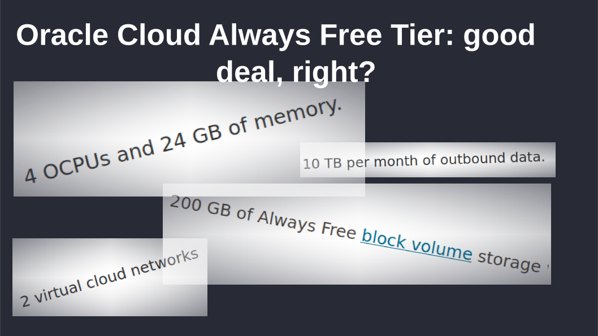
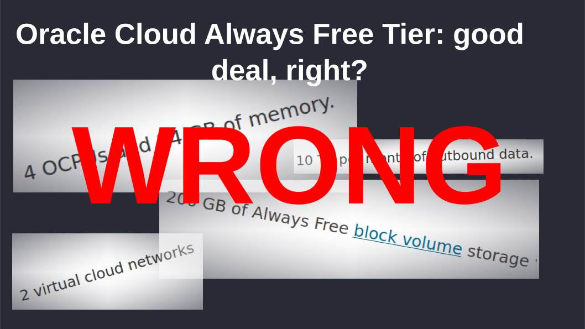
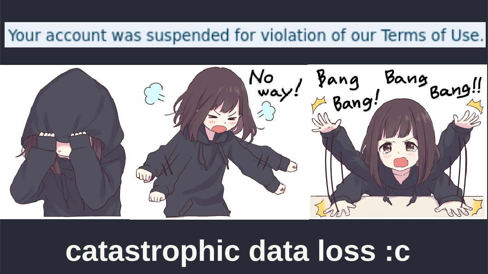
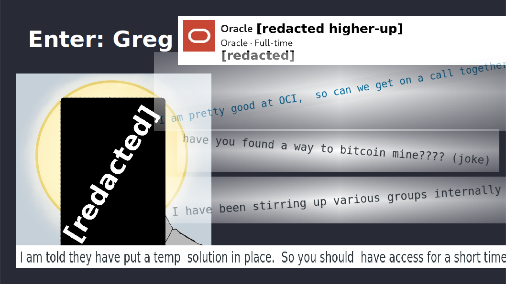

A month or two ago a [friend of mine](https://skye.purchasethe.uk) ran a silly
little event with a bunch of people where we each drank about six or seven
shots of alcohol, and then tried to deliver a presentation using slides we had
never seen before, which one of the other attendees had made beforehand.

At the time I had just been dealing with a major outage of my main server,
which contained a lot of quite important data that wasn't properly backed up
anywhere (I *did* have a backup system, but I turned it off in 2022 when I ran
out of storage, and then forgot to actually deal with the problem, thanks
ADHD)[^1].

[^1]: In fairness, the threat model of "Oracle locks you out of your server
without giving you any warning whatsoever" had not even entered my mind. I
assumed that a vaguely reputable company would at least give a *warning*
first...

Anyway, I had fun making this silly little presentation, and I figure you might
have fun reading it:

  
  
  
  
  

  <button onclick="prev()">Previous Slide</button>
  
    <button onclick="next()">Next Slide</button>
  
  <a href="./original.odp">Original .odp presentation (no JS required)</a>

I did end up getting the data back, thanks to my insane luck in getting in
contact with Greg. Had I not been so lucky, all the data would be gone, without
even an explanation. The moral of the presentation isn't really about how great
Greg is, though. Greg's not even their real name.

What is the moral? Idk, there's a lot more to say about economies and
diseconomies of scale, about the ossification of corporate structures into
monstrosities where "computer says no" is a valid response; where even the
people at the top can't apply discretion to bend their self-imposed rules even
when they obviously should. But I'll leave that for another post.

For now, the moral is: check your backups! Mine are solid now, don't worry \^w\^
