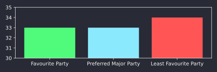
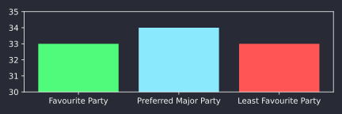

_[This post is part of a coordinated action started by Julia
Serano.](https://juliaserano.substack.com/p/lgbtq-people-are-not-going-back)_

The tides really are turning against us queer people, huh? Across the world,
the far-right is gaining power. Even here in the UK, one of the only countries
to supposedly shift left recently, it hardly matters -- the new Labour
government [continues to uphold attacks on trans
rights](https://www.scientificamerican.com/article/the-u-k-s-cass-review-badly-fails-trans-children/)
and pander to transphobes.

And now the Democrats in the US threaten to backslide on trans rights in much
the same way as Labour. Gotta have someone to scapegoat, right? Julia Serano,
along with many others, is encouraging US citizens to contact their Democrat
representatives (links and suggestions in her post) and commit to voting for
another party if they backslide on queer rights. Similarly, I encourage my UK
readers to [contact your
MP](https://www.parliament.uk/get-involved/contact-an-mp-or-lord/contact-your-mp/)
(if they are Labour, Conservative, or another transphobic party), and pledge to
vote Liberal Democrat if they continue their transphobic policies, such as
Labour's upholding of the puberty blocker ban.

There are a lot of things I could contribute to this coordinated action
explaining exactly what the Democrats and Labour are doing wrong, what rights
are being threatened, what you should say to them, and so on, but since I
expect a lot of other people are going to be doing that better than me (I
encourage you to read many of the other posts in this coordinated action!), I
want to instead focus on the loudest argument I hear against third party voting
specifically, namely "splitting the vote".

## The case for voting third party

Before you accuse third party voters of splitting the vote on the Left and
therefore causing an electoral catastrophe, let me present you with two rules
of thumb to convince you that _even if you vote short-term tactically_ in a
First-Preference Plurality[^fpp] system (e.g. UK elections and US elections),
the rational choice is often third party, a fact conveniently ignored (or
perhaps not understood) by the major-party-always camp.

[^fpp]: Also known (confusingly) as First-Past-the-Post. This is when you get
to vote for one candidate and the candidate that has the most votes gets the
win. Includes UK constituency elections and US House and Senate elections. US
presidential elections are a (bad) approximation of FPP.

::: emphasis

1. Vote for your favourite party if they are first or second in the polls.

2. Vote for your favourite party if your favourite and preferred-major parties
_combined_ are projected to win at least 2/3 of the vote.

:::

Ok, so rule 1 is obvious. Rule 2 is the really interesting one here though. Why
am I suggesting it? Well, here are the worst case scenarios in 3 party FPP,
above and below the 2/3 mark:

```python hidden
import matplotlib.pyplot as plt

# Data for the chart
labels = ['Favourite Party', 'Preferred Major Party', 'Least Favourite Party']
colors = ["C2", "C0", "C5"]

values = [33, 33, 34]
fig, ax = plt.subplots(figsize=(6, 2))
ax.bar(labels, values, color=colors)
ax.set_ylim(30, 35)
ax.set_yticks(range(30, 36))
plt.tight_layout()
plt.savefig("worst_case_66.svg")

values = [33, 34, 33]
fig, ax = plt.subplots(figsize=(6, 2))
ax.bar(labels, values, color=colors)
ax.set_ylim(30, 35)
ax.set_yticks(range(30, 36))
plt.tight_layout()
plt.savefig("worst_case_67.svg")
```
```output hidden
```

<figure>
  
  <figcaption>Worst case scenario with combined vote at 66%</figcaption>
</figure>

<figure>
  
  <figcaption>Worst case scenario with combined vote at 67%</figcaption>
</figure>

In a 3 party FPP election, if your favourite and preferred-major parties
combined are above 2/3 of the vote, then one of them is guaranteed to win --
the other party can't. Only under the 2/3 mark is it possible to split the
vote.

An example of this strategy being done successfully in 2024 is Islington North
in the UK, where the Labour majority was so strong that people felt comfortable
splitting the vote to vote for the newly-independent Jeremy Corbyn (previously
Labour), who is prominently in support of trans rights, among other grievances
with his ex-party now led by Kier Starmer. Corbyn won.

Remember, this is a _rule of thumb_. There are competing second-order effects
pushing up and down on the 2/3 number, so you should adjust the threshold based
on your judgement of your specific election. Here are some examples:

1. (Pushing up) If there are more than 2 alternate parties and the vote is
split among them, instead of 2/3 the threshold is higher: in theory (n+1)/(n+2)
where n is the number of "third" parties, although you can add all of the
smaller parties you are okay with to get over that mark.

2. (Pushing down) Some people whose preferred-major party is your least
favourite agree with you on the best party, and may vote for them if they see
no chance of their preferred-major party winning. (Example: many
anti-establishment voters preferred Bernie Sanders to Hillary Clinton, but also
Donald Trump to Hillary Clinton).

3. (Pushing up) Polls aren't 100% accurate, and the vote share could
end up above or below where it was projected to be. The lower the combined
polling vote share, the more risky voting third party is.

4. (Pushing down) 2/3 works even in the _worst case scenario_ of 3 parties, in
reality the vote between your favourite and preferred-major parties is unlikely
to be exactly 50/50 split.

5. (Pushing down) Voters don't swing overnight. If you're not hardcore
short-term rationalist, you should adjust the threshold lower -- by voting
third-party, you also increase the credibility of that party for future
elections.

6. (Pushing down) The rationality of 2/3 assumes that your preference difference
between your least favourite and preferred-major parties completely overwhelms
your preference difference between your favourite and preferred-major parties.
The worse your preferred-major party is, the greater the expected return
probabilitistically for voting riskily.

So, where does this rule apply? [Many Labour "safe" constituencies in the
UK](https://www.bbc.co.uk/news/election/2024/uk/results), [the House of
Representatives in many strongly Democrat areas in the
US](https://www.nytimes.com/interactive/2024/11/05/us/elections/results-house.html),
and occasionally US senate races, although not quite this time ([Hawaii was
close](https://www.nytimes.com/interactive/2024/11/05/us/elections/results-senate.html))

To reiterate, here's the core idea, which should be intuitive as well as
provably rational: _even if you are short-term rationalist_ you can safely vote
third party when your preferred-major party is dominating the opposition. Don't
be afraid to do it, because this doesn't just get better people into power,
it's also a powerful force to keep major parties in line with their core
supporters rather than just pandering to centrists. [^pr]

[^pr]: A _much, much_ better force would be a voting system that is actually
fair, like Single Transferable Vote. Just get the Liberal Democrats into power
_once_ in the UK, and all our future elections will be much fairer, no tactical
voting required.
