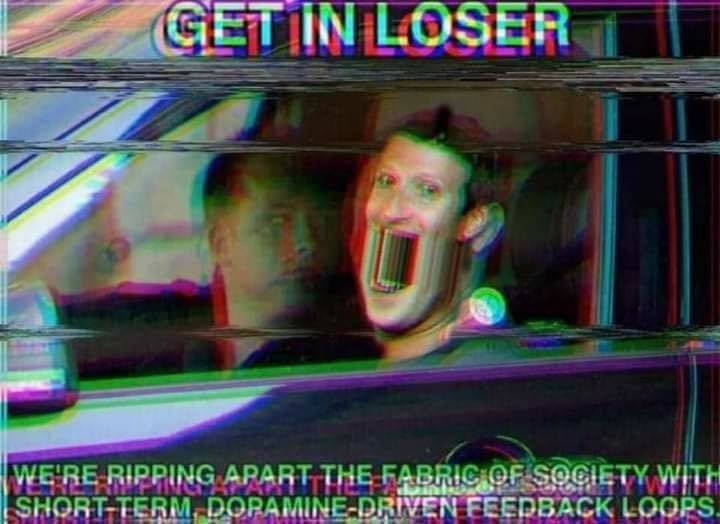

Almost three years ago, [I decided to write a
manifesto](https://ellie.clifford.lol/blog/0003-taking-back-control-1/)
detailing how I did -- and didn't -- want to use technology. Thus began a
series of blog posts; by [Part
3](https://ellie.clifford.lol/blog/0007-taking-back-control-3/) a rosy picture
was being painted of how well I was doing. [Part
4](https://ellie.clifford.lol/blog/0008-taking-back-control-4/), the most
recent, detailed the biggest remaining pain point as I perceived it
(interoperability of messaging systems), and how I had decided to resolve it.
That was two years ago[^two], so you'd be forgiven for thinking that the story
was basically over, and nothing remaining was worth writing a blog post about.

[^two]: That can't be right, I could have sworn it was two _months_ ago.

That is not what happened.

To a first approximation I have one device that breaks the manifesto, with its
collection of vices, and that is my old Android smartphone, nicknamed "Mind
Flayer", complete with the full set of attention-stealing dopamine-driven apps:
Reddit (and its open-source clone Lemmy), YouTube, Instagram, etc. You might
remember that in [Part
3](https://ellie.clifford.lol/blog/0007-taking-back-control-3/), I claimed to
have switched to a mainline-Linux-based phone, nicknamed "Flumph", and while
that was technically true, Mind Flayer has continued to stick around alongside
it, unshakeable in it's ability to steal my attention, particularly when I have
been stressed or otherwise vulnerable. The name "Mind Flayer", then, after the
tentacled monster of Dungeons and Dragons that psychically enslaves people, is
more apt than I could ever have imagined when I named the device.

The state of mind this constant attention stealing puts people in is [described
well by Skye](https://skye.purchasethe.uk/blog/digital-detox/):

> I have an itch now to reach for my phone when I hear a notification ding,
> when I’m stuck on a programming task, when I don’t want to do a chore or
> worse the hobbies I really enjoy. Because it provides short term
> satisfication whilst my life (I feel) gets filled with screen time or angst.

Of course, this state is not particularly new. All the way back in 2008,
Mark Fisher wrote in his seminal book ["Capitalist
Realism"](https://en.wikipedia.org/wiki/Capitalist_Realism) about what he
called "depressive hedonia", a state of mind

> constituted not by an inability to get pleasure so much as it is by an
inability to do anything else *except* pursue pleasure. There is a sense that
'something is missing' -- but no appreciation that this mysterious, missing
enjoyment can only be accessed *beyond* the pleasure principle.

But while Fisher's thesis that depressive hedonia is primarily caused by a
rampantly individualistic, consumerist, fatalistic and yet ironically detached
society is still true, today's enablers of depressive hedonia are far more
sophisticated in their attention theft than the "Playstation, all-night TV and
marijuana" of 2008. Modern attention-stealing mechanisms can learn -- and they
do so effectively -- to do whatever maximises "engagement", leaving you bored
but still paying attention, unable to leave without missing out on what
everyone else is seeing, placated but never satisfied.

There is a sense now, too, that just as anti-capitalists must still earn
and spend money to eat, those against YouTube (for instance) must still post
their video essays on YouTube if they want to reach anyone. Some try, many do
reach people, but the power of a platform is that even those against the system
work within it and prop it up -- just as t-shirts of Che Guevara are made in
sweatshops and sold on Amazon.[^che]

[^che]: This should not be taken as an endorsement of Che Guevara.

<figure>

<figcaption>
Original source unknown
</figcaption>
</figure>

But back to the main point of this post, over the past few years and in
particular the past few months, I've been contemplating how I'd feel if I lost
Mind Flayer, or broke it, or otherwise stopped being able to use it. And the
more I think, the more I realise that there is one emotion that would dominate
all the rest.

Relief. Relief that I would finally be free from its tentacles.

So why don't I just throw it in the River Cam?

[Maria
Farrell](https://conversationalist.org/2019/09/13/feminism-explains-our-toxic-relationships-with-our-smartphones/)
likens our use of smartphones to an abusive relationship:

> They isolate us from deeper, competing relationships in favour of
> superficial contact -- 'user engagement' -- that keeps their hold on us
> strong. [...] They tell us the onus is on us to manage their behavior. It's our job to
> tiptoe around them and limit their harms. Spending too much time on a
> literally-designed-to-be-behaviorally-addictive phone? [...] We just need
> to use willpower. We just need to be good enough to deserve them.

> And look around. Everyone has a smartphone. So it's probably not so bad, and
> anyway, that's just how things work. Right?

The simple fact is that these systems I have been trying to pull away
from *haven't let me.* Not because of technical limitations, not because of
interoperability, not even because the useful parts of their functionality
can't be replaced by other tools. No. Simply because attention stealing systems
have brain-invading tentacles specifically designed to be hard to get rid of.

The maddening thing is that there are just one or two things that I _do_ need
Mind Flayer for. But having it _around_ in order to do those infrequent things
goes about as well as giving a heroin addict unsupervised access to the back
room of a pharmacy in case they need some paracetamol.

I have spoken to many people who downplay the threat that surveillance
capitalism and these increasingly powerful attention algorithms pose. But I
challenge anyone who regularly uses attention stealing platforms: I'm sure you
think you can stop any time you want. But really _try_ to go cold turkey. See
how easy it is. I've seen countless people try and fail, most of all myself.

Many of the posts on this blog are tongue-in-cheek, but when I say this I am
deadly serious: attention algorithms are _already_ a threat to our cognitive
freedom, and this situation is likely to get orders of magnitude worse in the
coming decades.

When I wrote the first draft of this post, I planned to end it with this
paragraph:

> I would love to throw Mind Flayer in the River Cam. I won't, because that
> would be environmentally hazardous littering, but I've done what I hope is
> the next best thing -- wiped it clean, and put it at the bottom of a deep
> drawer where maybe it will finally die.

I wrote those lines before actually _taking_ that step, assuming that in a
couple weeks I'd figure out how to export all the data from Mind Flayer, wipe
it, and then post this post.

It has now been six months.

I still haven't wiped it. A full export of the data isn't as easy as it should
be. The tentacles whisper in my ear, telling me I'll regret it, I _need_ it. Am
I stuck in a gothic horror book?

But at last, a stroke of luck, Mind Flayer has partially broken on it's own.
It's broken in a very convenient way, too -- it's still usable, but only
awkwardly: the touchscreen doesn't work, so i have to plug in a mouse to do
anything. This should be enough incentive to stop using it (without losing all
the data), but simultaneously, I partially broke Flumph at the software level
and have now spent several days in total failing to fix it.

Perhaps it's not a gothic horror I'm stuck in after all, but a tragicomedy?

Still, although I still use Mind Flayer somewhat, the killing blow has been
dealt; its tentacles writhe feebly, unable to keep their hold on my brain,
cursed to limp on forever, a parasite without a host.

Hopefully Part 6 won't take another two years.
